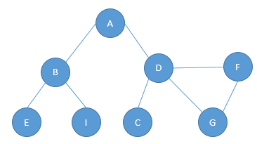
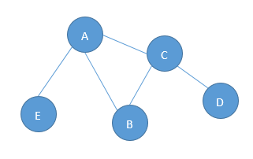
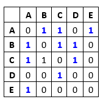
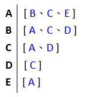

# Graph 圖形
圖形是另外一種非線性資料結構

圖形是由多個節點 (頂點) 與邊所組成。

任何二元關係都可以用圖形來表示。

一個圖形 G = (V, E) 由以下元素組成
- V (Vertex)： 一組頂點
- E (Edge)： 一組邊，連接 V 中的頂點3



由一條邊連接再一起的頂點稱為`相鄰頂點`

一個頂點的`度`是其相鄰頂點的數量

簡單路徑要求不包含重複的頂點

## 有向圖和無向圖
當邊出現有方向性時，這個圖稱為有向圖;反之，無向圖。

如果兩個頂點間在雙向上都存在方向，則該圖形是強連接的 A &lrarr; B

## 圖形的表示
那節點與邊要如何表示其關係呢?以下將介紹幾種作法

### 相鄰矩陣



假設兩節點之間存在邊，就在矩陣上將其標註為 1。

### 相鄰串列
就是使用一維陣列的方式將有關係的存下來





### 關聯矩陣

## 圖形的遍歷
廣度優先搜尋

深度優先搜尋

|演算法|資料結構|描述|
|-----|--------|----|
|深度優先搜尋|堆疊|藉由將頂點存入堆疊中，頂點是顏這路徑被探索的，存在新的相鄰頂點就去訪問|
|廣度優先搜尋|佇列|藉由將頂點存入柱列中，最香入佇列的頂點先被探索|

```js
class Graph {
	constructor() {
		this.adjList = {};
	}

	addVertex(vertex) {
		if (!this.adjList[vertex]) {
			this.adjList[vertex] =[];
		}
	};

	addEdge(v1, v2) {
		// 兩個列表都要加入，因為彼此都必須存在於各自的列表中
		this.adjList[v1].push(v2);
		this.adjList[v1].push(v1);
	};

	removeEdge(v1, v2) {
		this.adjList[v1] = this.adjList[v1].fiter(v => v !== v2)

		this.adjList[v2] = this.adjList[v2].filter(v => v != v1)
	};

	removeVertex(vertex) {
		while (this.adjList[vertex].length) {
			const adjVertex = this.adjList[vertex].pop()
			this.removeEdge(vertex, adjVertex);
		}
	};

	depthFirstRecursive(start) {};
	depthFirstIterative(start) {};
	breadthFirst(start) {};
}
```