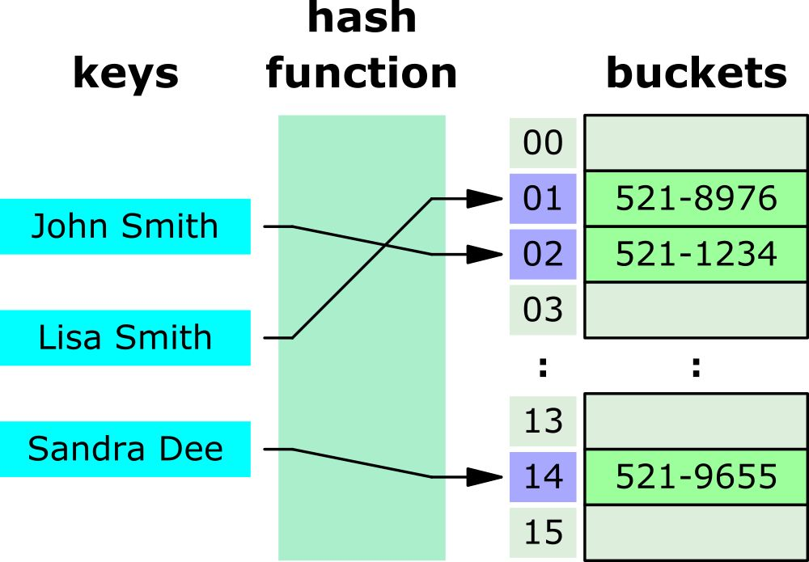

# Hash Table 雜湊表
雜湊演算法的作用是盡可能快的在資料結構中找到一個值 (key-value)。

這個與字典有些類似

`Hash Table` 透過 `hash function` 將 key 轉換成整數索引值，用這個索引值來找到記憶體中的值。



- put(key, value)
- remove(key)
- get(key)

```js
class HashTable {
	constructor() {
		this.table = []
	}

	put(key, value) {
		let position = this.loseloseHashCode(key)
		this.table[position] = value
	}

	get(key) {
		return this.table[this.loseloseHashCode(key)]
	}

	remove(key) {
		this.table[this.loseloseHashCode(key)] = undefined;
	}

	lostlostHashCode(key) {
		let hash = 0
		for (let i = 0; i < key.length; i++) {
			hash += key.charCodeAt(i);
		}
		return hash % 37;
	}
}
```

使用 HashTable 通常會有碰撞的問題，
最簡單的方式是當再加入時，發生碰撞，就在後面用二維振烈去儲存