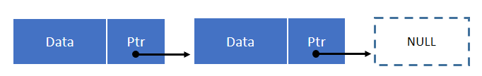

# Linked List 鏈結串列
與陣列相比並不需要連續的記憶體空間

鏈結串列的基本就是，有一個存放資料的點，然後有一個指標指向下一個。

基本上，鏈結串列的操作，有新增、刪除、插入

首先，要實作出鏈結串列有以下幾個步驟
- 定義串列的節點
	- 資料
	- 指向下一個節點的指標
- 新增
  - 由第一個開始判斷其下一個指標是否為空的
		- 是： 建立新的節點，並將指標指向這個節點
		- 否： 將指標移動到下一節點，繼續搜尋
- 刪除
	- 進行節點的查找，移動指標到下一格，直至結束
		- 當指向的下一個指標的資料是要找的資料，段開指標並指向下下一個
		- 沒找到，回傳沒找到
- 插入 (與刪除一樣)
	- 找到指定的位置將其插入，必須注意是在尾巴、開頭或是中間的情況



```js
// 節點的定義
class Node {
	constructor(data) {
		this.data = data;  // 節點儲存的資料
		this.next = null;  // 用來指向下一個節點
	}
}
```

```js
// Linked List
class LinkedList {
	constructor() {
		this.head = null;  // 用來最為指向第一個節點
		this.length = 0;  // 鏈結串列長度
	}
}
```

## 1. 新增
通常會新增到鏈結串列的尾部
```js
class LinkedList {
	constructor() {
		this.head = null;
		this.length = 0;
	}

	print() {
		let ptr = this.head;
		while(ptr) {
			console.log(ptr.data)
		}
	}

	append(data) {
		let node = new Node(data);

		if (this.head === null) {
			this.head = node;
		} else {
			let ptr = this.head;  // 在鏈結串列中移動的指標

			// 當指標中的下一個為空時，就結束
			while(ptr.next !== null) {
				ptr = ptr.next;
			}

			ptr.next = node;
		}

		this.length++;
	}
}
```

## 2. 刪除指定位置
```js
class LinkedList {
	...

	// remove 
	removeAt(index) {
		if (this.length === 0 || index > this.length - 1) {
			return null;
		}

		if (index === 0) {
			this.head = this.head.next;
		} else {
			let current = this.head;
			let prev = null;

			let idx = 0;
			while (idx < index) {
				idx++;
				prev = current;
				current = current.next;
			}
			prev.enxt = current.next;
		}

		length--;
	}
}
```

## 3. 插入
```js
class LinkedList {
	...
	InsertAt(index, data) {
		if (index < 0 || index > this.length) {
			return null;
		}

		let node = new Node(data);

		if (index === 0) {
			if (this.head === null) {
				this.head = node;
			} else {
				node.next = this.head;
				this.head = node;
			}
		} else {
			let idx = 0;
			let prev;
			let current = this.head;

			while(idx < index) {
				idx++;
				prev = current;
				current = current.next;
			}

			prev.next = node;
			node.next = current
		}

		this.length++;
	}
	...
}
```