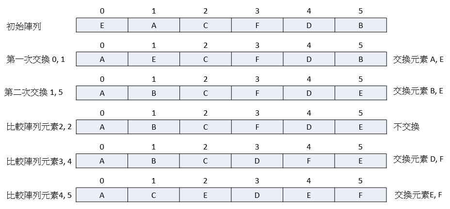

# Selection Sort 選擇排序
選擇排序法是從陣列中，挑出最小的一個元素，然後與第一個元素交換，接著再從剩下陣列元素中，找出最小的與第二個元素做交換，以此類推，直到結束。



```js
function SelectionSort(arr) {
	for (let i = 0; i < arr.length - 1; i++) {
		let pos = i;
		let min = arr[pos];

		for(let j = i; j < arr.length ; j++) {
			if (arr[j] < min) {
				pos = j;
				min = arr[j]
			}
		}

		swap(arr, i, pos)
	}

	return arr;
}


function swap(arr, a, b) {
	let temp = arr[a];

	arr[a] = arr[b];
	arr[b] = temp;
}
```