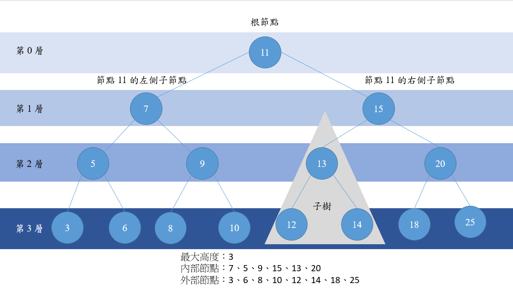

# Tree 樹
數，對於存放`需要快速找尋`的資料非常有用。
- 樹的結構包含一系列存在父子關係的節點
- 樹的頂點叫做根節點
- 每一個節點都有一個父節點 (除了根節點之外)，以及零或多個節點
- 樹的每個元素都叫做節點
- 至少有一個子元素的節點叫做內部節點
- 沒有子元素的節點叫做外部節點或是葉節點
- 節點的高度取決於祖先節點的數量
- 樹的高度取決於所有節點深度的最大值



## 二元搜尋樹
每個節點最多只能有兩個子節點

二元搜尋數，在右側節點存放 (比父節點) 大 (或是等於) 的值，左側節點存放 (比父節點) 小的值。

## 建立 BinarySearchTree 類別
首先建立存放資料的節點
```js
class Node() { 
	constructor(key) { 
		this.key = key; 
		this.left = null; 
		this.right = null; 
	}
}
```

下面是必須在樹類別中實作的方法
- insert(key)
- search(key)
- inOrderTraverse
- preOrderTraverse
- postOrderTraverse
- min
- max 
- remove(key)

這邊需要記憶的點為
- preOrder： 中 &rarr; 左 &rarr; 右
- inOrder：左 &rarr; 中 &rrarr; 右
- postOrder：左 &rarr; 右 &rarr; 中

```js
class BinarySearchTree {
	constructor() {
		this.root = null;
	}

	insert(key) {
		let newNode = new Node(key)

		if (this.root === null) {
			root = newNode;
		} else {
			this.insertNode(root, newNode);
		}
	}

	insertNode(node, newNode) {
		if (newNode.key < node.key>) {
			if (node.left === null) {
				node.left = newNode;
			} else {
				insertNode(node.left, newNode);
			}
		} else {
			if (node.right === null) {
				node.right = newNode;
			} else {
				insertNode(node.right, newNode);
			}
		}
	}

	search(value) {
		if (this.root === null) return false;

		let current = this.root;

		let found = false;

		while(current && !found) {
			if (value < current.value) {
				current = current.left;
			} else if (value > current.value) {
				current = current.right
			} else {
				found = true;
			}
		}
	}

	inOrderTraverse() { 
		let arr = []; 
		let current = this.root; 
		
		this.inOrder(current, arr);
        return arr;
	}
	
	inOrder(node, arr) { 
		if (node === null) return; 
		this.inOrder(node.left, arr); 
		arr.push(node.key) 
		this.inOrder(node.right, arr); 
	}

	preOrderTraverse() { 
		let arr = []; 
		let current = this.root; 
		
		this.preOrder(current, arr); 
		return arr; 
	} 
		
	preOrder(node, arr) { 
		console.log(arr) 
		if (node === null ) return; 
		arr.push(node.key); 
		this.preOrder(node.left, arr); 
		this.preOrder(node.right, arr); 
	}

	postOrderTraverse() { 
		let arr = []; 
		let current = this.root; 
		
		this.postOrder(current, arr) 
		return arr; 
	}

  postOrder(node, arr) { 
		if (node === null) return; 
		
		this.postOrder(node.left, arr); 
		this.postOrder(node.right, arr); 
		arr.push(node.key);
  }
}
```